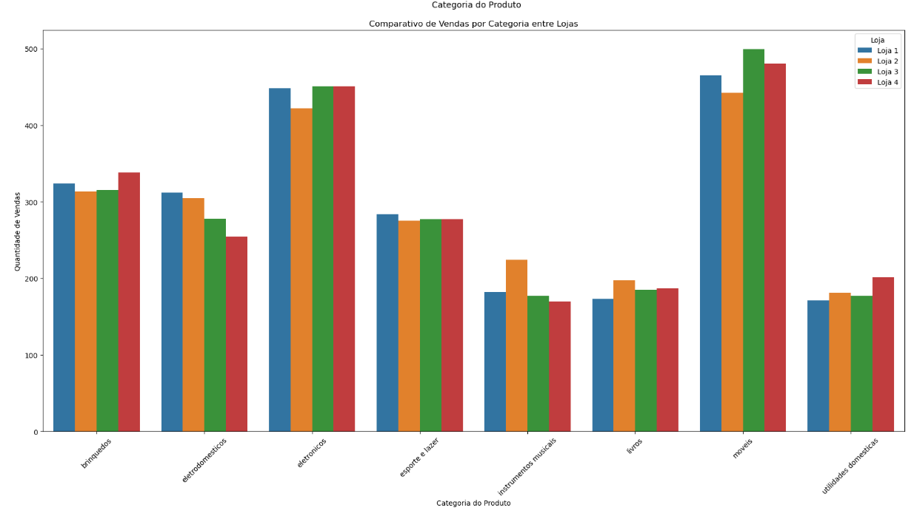
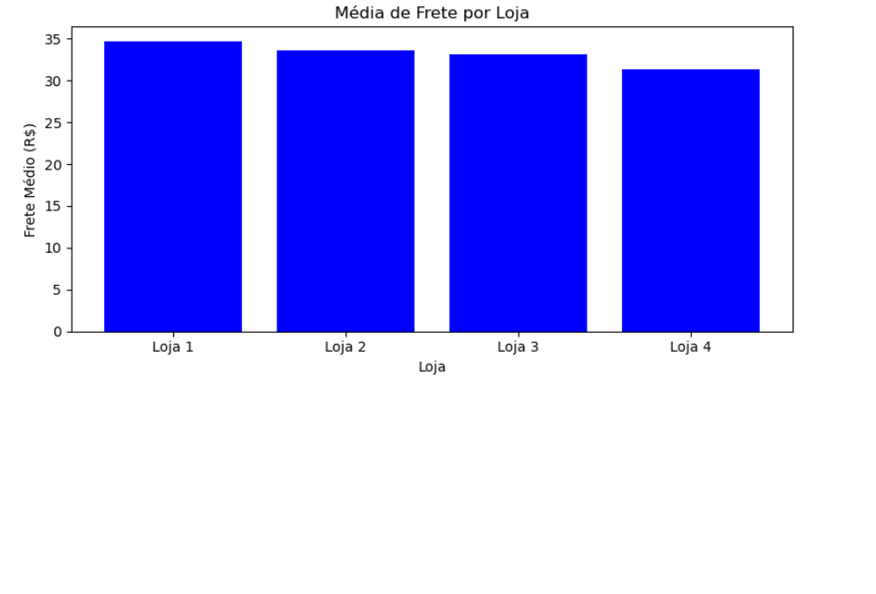
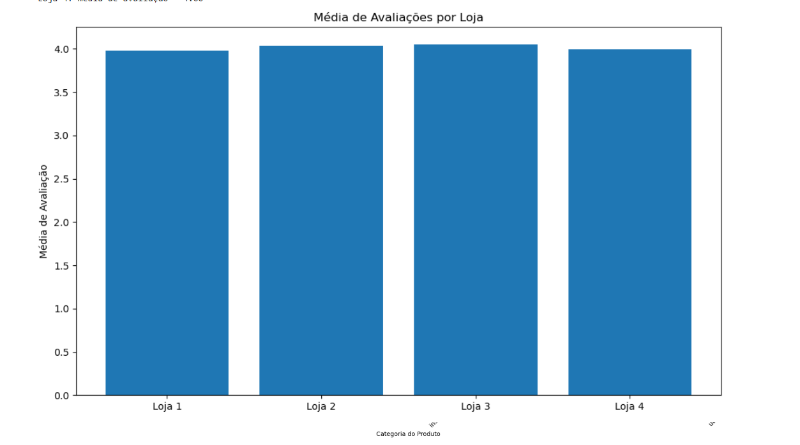

# 🛒 AluraStoreBr - Análise de Dados com Python


Projeto de análise exploratória de dados de uma loja virtual fictícia, a **AluraStore**, com foco em identificar padrões de compra, produtos mais vendidos, categorias em destaque e outros insights que possam apoiar decisões estratégicas.

---

## 📌 Objetivos do Projeto

- 📦 Entender o comportamento de compra dos clientes  
- 🛍️ Identificar os produtos e categorias mais populares  
- 🌎 Verificar distribuição geográfica das vendas  
- 📈 Propor ações baseadas em dados para melhorar o desempenho da loja

---

## 📁 Estrutura do Notebook

```text
🔹 AluraStoreBr.ipynb
   ├── Importação de bibliotecas
   ├── Leitura e limpeza de dados
   ├── Análise exploratória
   ├── Visualizações com gráficos
   └── Conclusões e recomendações
```

---

## 🧪 Tecnologias Utilizadas

- [Python](https://www.python.org/)
- [Pandas](https://pandas.pydata.org/)
- [Seaborn](https://seaborn.pydata.org/)
- [Matplotlib](https://matplotlib.org/)
- Jupyter Notebook

---

## 🚀 Como Executar Localmente

1. Clone o repositório:

   ```bash
   git clone https://github.com/seu-usuario/seu-repositorio.git
   cd seu-repositorio
   ```

2. Crie e ative um ambiente virtual (opcional, mas recomendado):

   ```bash
   python -m venv venv
   source venv/bin/activate  # Linux/macOS
   venv\Scripts\activate     # Windows
   ```

3. Instale as dependências:

   ```bash
   pip install -r requirements.txt
   ```

4. Execute o Jupyter Notebook:

   ```bash
   jupyter notebook AluraStoreBr.ipynb
   ```


### 📊 Visualizações dos resultados

#### Categoria de produto mais vendido dentre as lojas


#### Média de Frete por Loja


#### Média de Avaliações por Loja



---
## 🏅 Certificação
Fui reconhecido com a seguinte Badge pelo programa ONE (Oracle Next Education), uma iniciativa da Alura Latam em parceria com a Oracle:


